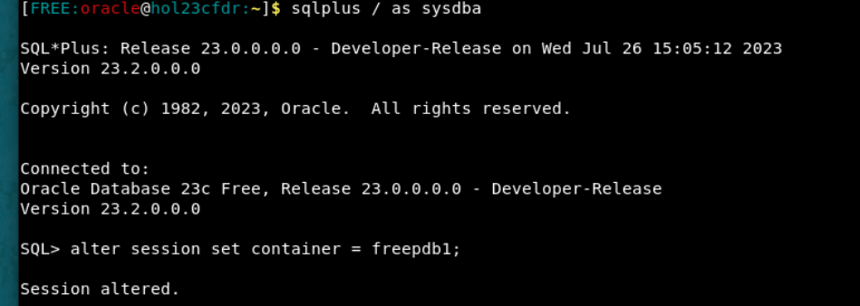
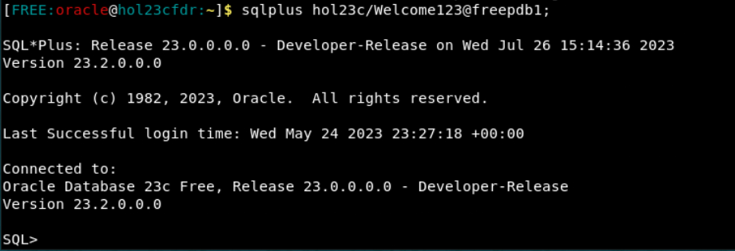
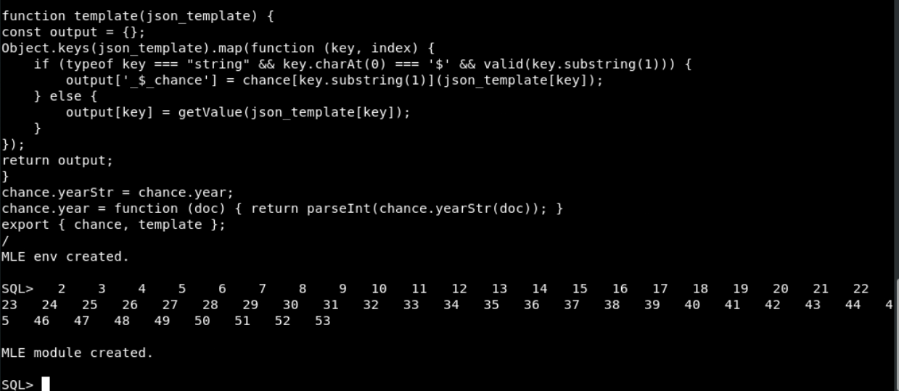
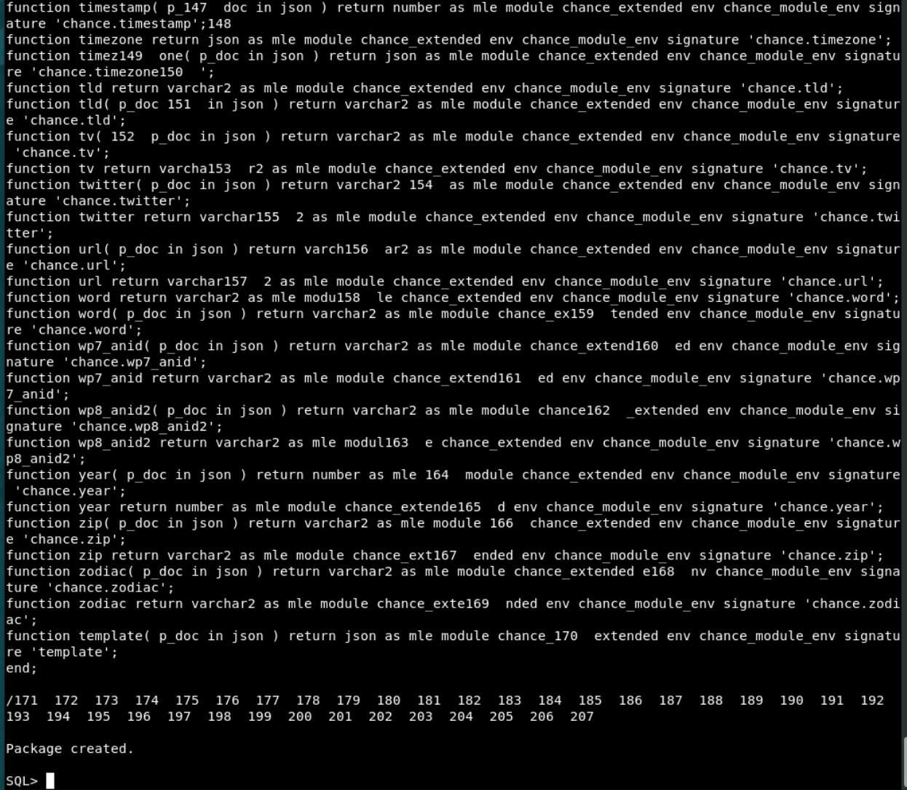
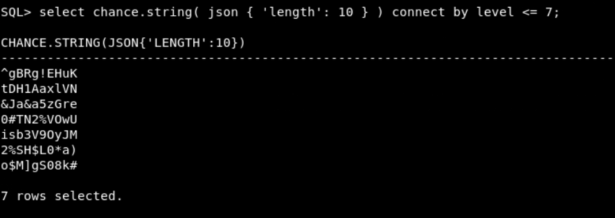
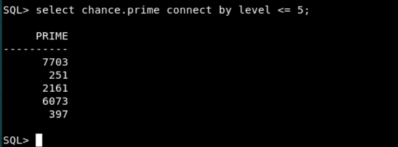
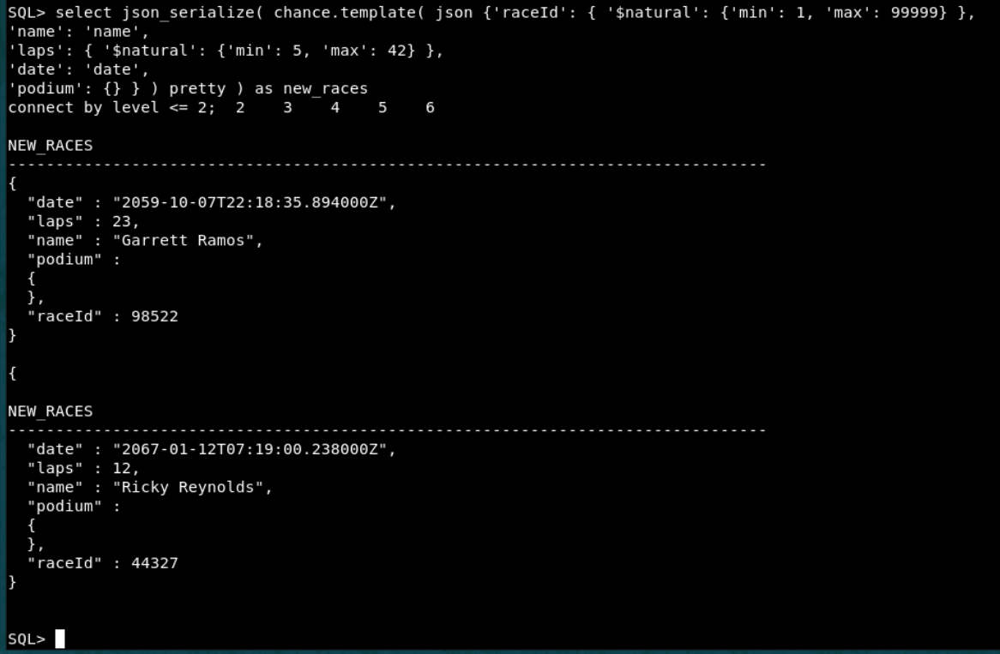

# Get up and running using Chance with JS with 23c Free

## Introduction

This post explains how to use the [Chance.js](https://www.jsdelivr.com/package/npm/chance) library and how to provide JSON template feature inspired from the [Fony.js](https://github.com/captainsafia/fony) library so that you can generate random JSON data using SQL:

Estimated Time: 15 minutes

### Objectives 

In this lab you will have: 
* Oracle Database 23c Free Developer Release
* All previous labs successfully completed
* Populate data with JS/Chance 

### Prerequisites 

This labs assumes you have: 
* Oracle Database 23c Free Developer Release
* All previous labs successfully completed 
* SQL Developer Web 23.1 or a compatible tool for running SQL statements

## Task 1: Setup

1. First things first, let's start
  Remark: The following scripts are run on an Oracle database 23c FREE - Developer Release using sqlplus.
    
    ```
    <copy>
    mkdir mle
    </copy> 
    ```
    

2. Next, let's edit hol23c and grant the right privileges for getting started:

    ```
    <copy>
    sqlplus / as sysdba 
    </copy>
    ```
    

3. Next, we will alter our session container 
    ```
    <copy>
    alter session set container = freepdb1;
    </copy>
    ```
     

4. Now, lets grant the DB DEVELOPER_ROLE to hol23c
    ```
    <copy>
    grant DB_DEVELOPER_ROLE to hol23c; 
    </copy>
    ```
     

5. Then, we grant access to execute javascript
    ```
    <copy> 
    grant execute on javascript to hol23c;
    </copy>
    ```
     

6. Create the directory to access filesystem where we'll download our ES Modules
    ```
    <copy> 
    create directory mle_dir as '/home/oracle/mle';
    </copy>
    ```
     

7. Grant access filesystem where we'll download our ES Modules
    ```
    <copy>
    grant read on directory mle_dir to hol23c;
    </copy>
    ```
     

8. Exit SQLPLUS
    ```
    <copy>
    exit
    </copy>
    ```
     
    

## Task 2: Install Chance.js ES Module
For the rest of this post, we'll focus on the [Chance.js](https://www.jsdelivr.com/package/npm/chance) module from [Victor Quinn](https://www.victorquinn.com/about/) under [MIT License](https://en.wikipedia.org/wiki/MIT_License). This module is really interesting when working on data as it provides _numerous_ ways to "generate random numbers, characters, strings, names, addresses, dice, and pretty much anything else"; in brief 100+ new data generators.


1. The latest version available at the time of writing is 1.1.11, so let's download it into our mle folder so that it can be used by the database
    ```
    <copy>
    curl -Lo ./mle/chance.js https://cdn.jsdelivr.net/npm/chance@1.1.11/+esm 
    </copy>
    ```
     

2. And now connect as a hol23c, run 
    ```
    <copy>
    sqlplus hol23c/'YourPassword'@freepdb1;
    </copy>
    ```
     

3. Now that you're connected as `hol23c`, run SET VERIFY OFF. This will avoid SQL Plus displaying before and after images of each line that contains a substitution variable
    ```
    <copy>
    SET VERIFY OFF
    </copy>
    ```
     

4. Now that you're connected as `hol23c`, run SET DEFINE OFF. This will prevent substitution issues since we are using PL/SQL since '&' creates issues with script
    ```
    <copy>
    SET DEFINE OFF
    </copy>
    ```
     

5. Creates the MLE module named chance_module
    ```
    <copy>
    create or replace mle module chance_module language javascript version '1.1.11' using bfile( mle_dir, 'chance.js' );
    /
    </copy>
    ```  
     

6. Creates the corresponding MLE environment that will help for managing dependencies at runtime
    ```
    <copy>
    create or replace mle env chance_module_env imports ('chance' module chance_module);
    </copy>
    ```
    

7. Creates a new 'extended' module that will export properly the functions for future usage in PL/SQL
    ```
    <copy>
    create or replace mle env chance_module_env imports ('chance' module chance_module);
    create or replace mle module chance_extended language javascript version '1.1.11' as
import Chance from 'chance';
const chance = new Chance();
const chanceTypes = Object.keys(Object.getPrototypeOf(chance));

function valid(type) {
    return chanceTypes.indexOf(type) !== -1;
}

function getArrayValue(definition) {
    if (definition.length !== 2) {
        return null;
    }
    const type = definition[0];
    const count = definition[1];
    if (!valid(type) || typeof count !== "number" || count === 0) {
        return null;
    }
    return new Array(count).fill(null).map(function () {
        return getValue(type);
    });
}

function getValue(type) {
    if (Array.isArray(type)) {
        return getArrayValue(type);
    }
    if (typeof type === "object" && !Array.isArray(type) && type != null) {
        var result = template(type);
        return result._$_chance ? result._$_chance : result;
    }
    try {
        return chance[type]();
    } catch (exception) {
        return null;
    }
}

function template(json_template) {
    const output = {};
    Object.keys(json_template).map(function (key, index) {
        if (typeof key === "string" && key.charAt(0) === '$' && valid(key.substring(1))) {
            output['_$_chance'] = chance[key.substring(1)](json_template[key]);
        } else {
            output[key] = getValue(json_template[key]);
        }
    });
    return output;
}
chance.yearStr = chance.year;
chance.year = function (doc) { return parseInt(chance.yearStr(doc)); }
export { chance, template };
    /
    </copy>
    ```
    

## Task 3: Lets intergrate the SQL engine with the JavaScript MLE using PL/SQL functions
Installing a PL/SQL package to make Chance functions accessible in SQL

1. See how the chance module env MLE environment is being used so that dependencies resolution goes well
    ```
    <copy>
    create or replace package chance as
    function address( p_doc in json ) return varchar2 as mle module chance_extended env chance_module_env signature 'chance.address';
    function address return varchar2 as mle module chance_extended env chance_module_env signature 'chance.address';
    function age return number as mle module chance_extended env chance_module_env signature 'chance.age';
    function age( p_doc in json ) return number as mle module chance_extended env chance_module_env signature 'chance.age';
    function altitude return number as mle module chance_extended env chance_module_env signature 'chance.altitude';
    function altitude( p_doc in json ) return number as mle module chance_extended env chance_module_env signature 'chance.altitude';
    function ampm( p_doc in json ) return varchar2 as mle module chance_extended env chance_module_env signature 'chance.ampm';
    function ampm return varchar2 as mle module chance_extended env chance_module_env signature 'chance.ampm';
    function android_id( p_doc in json ) return varchar2 as mle module chance_extended env chance_module_env signature 'chance.android_id';
    function android_id return varchar2 as mle module chance_extended env chance_module_env signature 'chance.android_id';
    function animal( p_doc in json ) return varchar2 as mle module chance_extended env chance_module_env signature 'chance.animal';
    function animal return varchar2 as mle module chance_extended env chance_module_env signature 'chance.animal';
    function apple_token( p_doc in json ) return varchar2 as mle module chance_extended env chance_module_env signature 'chance.apple_token';
    function apple_token return varchar2 as mle module chance_extended env chance_module_env signature 'chance.apple_token';
    function areacode return varchar2 as mle module chance_extended env chance_module_env signature 'chance.areacode';
    function areacode( p_doc in json ) return varchar2 as mle module chance_extended env chance_module_env signature 'chance.areacode';
    function avatar( p_doc in json ) return varchar2 as mle module chance_extended env chance_module_env signature 'chance.avatar';
    function avatar return varchar2 as mle module chance_extended env chance_module_env signature 'chance.avatar';
    function bb_pin return varchar2 as mle module chance_extended env chance_module_env signature 'chance.bb_pin';
    function bb_pin( p_doc in json ) return varchar2 as mle module chance_extended env chance_module_env signature 'chance.bb_pin';
    function birthday( p_doc in json ) return date as mle module chance_extended env chance_module_env signature 'chance.birthday';
    function birthday return date as mle module chance_extended env chance_module_env signature 'chance.birthday';
    function bool( p_doc in json ) return boolean as mle module chance_extended env chance_module_env signature 'chance.bool';
    function bool return boolean as mle module chance_extended env chance_module_env signature 'chance.bool';
    function cc return varchar2 as mle module chance_extended env chance_module_env signature 'chance.cc';
    function cc( p_doc in json ) return varchar2 as mle module chance_extended env chance_module_env signature 'chance.cc';
    function cc_type return varchar2 as mle module chance_extended env chance_module_env signature 'chance.cc_type';
    function cc_type( p_doc in json ) return varchar2 as mle module chance_extended env chance_module_env signature 'chance.cc_type';
    function cf( p_doc in json ) return varchar2 as mle module chance_extended env chance_module_env signature 'chance.cf';
    function cf return varchar2 as mle module chance_extended env chance_module_env signature 'chance.cf';
    function character return varchar2 as mle module chance_extended env chance_module_env signature 'chance.character';
    function character( p_doc in json ) return varchar2 as mle module chance_extended env chance_module_env signature 'chance.character';
    function city( p_doc in json ) return varchar2 as mle module chance_extended env chance_module_env signature 'chance.city';
    function city return varchar2 as mle module chance_extended env chance_module_env signature 'chance.city';
    function coin( p_doc in json ) return varchar2 as mle module chance_extended env chance_module_env signature 'chance.coin';
    function coin return varchar2 as mle module chance_extended env chance_module_env signature 'chance.coin';
    function color( p_doc in json ) return varchar2 as mle module chance_extended env chance_module_env signature 'chance.color';
    function color return varchar2 as mle module chance_extended env chance_module_env signature 'chance.color';
    function company return varchar2 as mle module chance_extended env chance_module_env signature 'chance.company';
    function company( p_doc in json ) return varchar2 as mle module chance_extended env chance_module_env signature 'chance.company';
    function country return varchar2 as mle module chance_extended env chance_module_env signature 'chance.country';
    function country( p_doc in json ) return varchar2 as mle module chance_extended env chance_module_env signature 'chance.country';
    function county return varchar2 as mle module chance_extended env chance_module_env signature 'chance.county';
    function county( p_doc in json ) return varchar2 as mle module chance_extended env chance_module_env signature 'chance.county';
    function cpf return varchar2 as mle module chance_extended env chance_module_env signature 'chance.cpf';
    function cpf( p_doc in json ) return varchar2 as mle module chance_extended env chance_module_env signature 'chance.cpf';
    function currency return json as mle module chance_extended env chance_module_env signature 'chance.currency';
    function currency( p_doc in json ) return json as mle module chance_extended env chance_module_env signature 'chance.currency';
    function currency_pair( p_doc in json ) return json as mle module chance_extended env chance_module_env signature 'chance.currency_pair';
    function currency_pair return json as mle module chance_extended env chance_module_env signature 'chance.currency_pair';
    function d10( p_doc in json ) return number as mle module chance_extended env chance_module_env signature 'chance.d10';
    function d10 return number as mle module chance_extended env chance_module_env signature 'chance.d10';
    function d100 return number as mle module chance_extended env chance_module_env signature 'chance.d100';
    function d100( p_doc in json ) return number as mle module chance_extended env chance_module_env signature 'chance.d100';
    function d12 return number as mle module chance_extended env chance_module_env signature 'chance.d12';
    function d12( p_doc in json ) return number as mle module chance_extended env chance_module_env signature 'chance.d12';
    function d20( p_doc in json ) return number as mle module chance_extended env chance_module_env signature 'chance.d20';
    function d20 return number as mle module chance_extended env chance_module_env signature 'chance.d20';
    function d30( p_doc in json ) return number as mle module chance_extended env chance_module_env signature 'chance.d30';
    function d30 return number as mle module chance_extended env chance_module_env signature 'chance.d30';
    function d4( p_doc in json ) return number as mle module chance_extended env chance_module_env signature 'chance.d4';
    function d4 return number as mle module chance_extended env chance_module_env signature 'chance.d4';
    function d6 return number as mle module chance_extended env chance_module_env signature 'chance.d6';
    function d6( p_doc in json ) return number as mle module chance_extended env chance_module_env signature 'chance.d6';
    function d8 return number as mle module chance_extended env chance_module_env signature 'chance.d8';
    function d8( p_doc in json ) return number as mle module chance_extended env chance_module_env signature 'chance.d8';
    function "date" return date as mle module chance_extended env chance_module_env signature 'chance.date';
    function "date"( p_doc in json ) return varchar2 as mle module chance_extended env chance_module_env signature 'chance.date';
    function "date"( p_doc in json, p_will_be_date in boolean ) return date as mle module chance_extended env chance_module_env signature 'chance.date';
    function depth return number as mle module chance_extended env chance_module_env signature 'chance.depth';
    function depth( p_doc in json ) return number as mle module chance_extended env chance_module_env signature 'chance.depth';
    function dollar return varchar2 as mle module chance_extended env chance_module_env signature 'chance.dollar';
    function dollar( p_doc in json ) return varchar2 as mle module chance_extended env chance_module_env signature 'chance.dollar';
    function domain( p_doc in json ) return varchar2 as mle module chance_extended env chance_module_env signature 'chance.domain';
    function domain return varchar2 as mle module chance_extended env chance_module_env signature 'chance.domain';
    function email return varchar2 as mle module chance_extended env chance_module_env signature 'chance.email';
    function email( p_doc in json ) return varchar2 as mle module chance_extended env chance_module_env signature 'chance.email';
    function euro return varchar2 as mle module chance_extended env chance_module_env signature 'chance.euro';
    function euro( p_doc in json ) return varchar2 as mle module chance_extended env chance_module_env signature 'chance.euro';
    function exp return varchar2 as mle module chance_extended env chance_module_env signature 'chance.exp';
    function exp( p_doc in json ) return varchar2 as mle module chance_extended env chance_module_env signature 'chance.exp';
    function exp_month( p_doc in json ) return varchar2 as mle module chance_extended env chance_module_env signature 'chance.exp_month';
    function exp_month return varchar2 as mle module chance_extended env chance_module_env signature 'chance.exp_month';
    function exp_year( p_doc in json ) return varchar2 as mle module chance_extended env chance_module_env signature 'chance.exp_year';
    function exp_year return varchar2 as mle module chance_extended env chance_module_env signature 'chance.exp_year';
    function falsy return varchar2 as mle module chance_extended env chance_module_env signature 'chance.falsy';
    function falsy( p_doc in json ) return varchar2 as mle module chance_extended env chance_module_env signature 'chance.falsy';
    function fbid return varchar2 as mle module chance_extended env chance_module_env signature 'chance.fbid';
    function fbid( p_doc in json ) return varchar2 as mle module chance_extended env chance_module_env signature 'chance.fbid';
    function first( p_doc in json ) return varchar2 as mle module chance_extended env chance_module_env signature 'chance.first';
    function first return varchar2 as mle module chance_extended env chance_module_env signature 'chance.first';
    function floating( p_doc in json ) return number as mle module chance_extended env chance_module_env signature 'chance.floating';
    function floating return number as mle module chance_extended env chance_module_env signature 'chance.floating';
    function gender return varchar2 as mle module chance_extended env chance_module_env signature 'chance.gender';
    function gender( p_doc in json ) return varchar2 as mle module chance_extended env chance_module_env signature 'chance.gender';
    function geohash return varchar2 as mle module chance_extended env chance_module_env signature 'chance.geohash';
    function geohash( p_doc in json ) return varchar2 as mle module chance_extended env chance_module_env signature 'chance.geohash';
    function geojson return json as mle module chance_extended env chance_module_env signature 'chance.geojson';
    function geojson( p_doc in json ) return json as mle module chance_extended env chance_module_env signature 'chance.geojson';
    function google_analytics( p_doc in json ) return varchar2 as mle module chance_extended env chance_module_env signature 'chance.google_analytics';
    function google_analytics return varchar2 as mle module chance_extended env chance_module_env signature 'chance.google_analytics';
    function guid( p_doc in json ) return varchar2 as mle module chance_extended env chance_module_env signature 'chance.guid';
    function guid return varchar2 as mle module chance_extended env chance_module_env signature 'chance.guid';
    function hammertime return number as mle module chance_extended env chance_module_env signature 'chance.hammertime';
    function hammertime( p_doc in json ) return number as mle module chance_extended env chance_module_env signature 'chance.hammertime';
    function hash return varchar2 as mle module chance_extended env chance_module_env signature 'chance.hash';
    function hash( p_doc in json ) return varchar2 as mle module chance_extended env chance_module_env signature 'chance.hash';
    function hashtag( p_doc in json ) return varchar2 as mle module chance_extended env chance_module_env signature 'chance.hashtag';
    function hashtag return varchar2 as mle module chance_extended env chance_module_env signature 'chance.hashtag';
    function hour( p_doc in json ) return number as mle module chance_extended env chance_module_env signature 'chance.hour';
    function hour return number as mle module chance_extended env chance_module_env signature 'chance.hour';
    function iban return varchar2 as mle module chance_extended env chance_module_env signature 'chance.iban';
    function iban( p_doc in json ) return varchar2 as mle module chance_extended env chance_module_env signature 'chance.iban';
    function "integer" return number as mle module chance_extended env chance_module_env signature 'chance.integer';
    function "integer"( p_doc in json ) return number as mle module chance_extended env chance_module_env signature 'chance.integer';
    function ip( p_doc in json ) return varchar2 as mle module chance_extended env chance_module_env signature 'chance.ip';
    function ip return varchar2 as mle module chance_extended env chance_module_env signature 'chance.ip';
    function ipv6( p_doc in json ) return varchar2 as mle module chance_extended env chance_module_env signature 'chance.ipv6';
    function ipv6 return varchar2 as mle module chance_extended env chance_module_env signature 'chance.ipv6';
    function klout( p_doc in json ) return number as mle module chance_extended env chance_module_env signature 'chance.klout';
    function klout return number as mle module chance_extended env chance_module_env signature 'chance.klout';
    function last return varchar2 as mle module chance_extended env chance_module_env signature 'chance.last';
    function last( p_doc in json ) return varchar2 as mle module chance_extended env chance_module_env signature 'chance.last';
    function latitude return number as mle module chance_extended env chance_module_env signature 'chance.latitude';
    function latitude( p_doc in json ) return number as mle module chance_extended env chance_module_env signature 'chance.latitude';
    function letter( p_doc in json ) return varchar2 as mle module chance_extended env chance_module_env signature 'chance.letter';
    function letter return varchar2 as mle module chance_extended env chance_module_env signature 'chance.letter';
    function locale return varchar2 as mle module chance_extended env chance_module_env signature 'chance.locale';
    function locale( p_doc in json ) return varchar2 as mle module chance_extended env chance_module_env signature 'chance.locale';
    function longitude( p_doc in json ) return number as mle module chance_extended env chance_module_env signature 'chance.longitude';
    function longitude return number as mle module chance_extended env chance_module_env signature 'chance.longitude';
    function millisecond return number as mle module chance_extended env chance_module_env signature 'chance.millisecond';
    function millisecond( p_doc in json ) return number as mle module chance_extended env chance_module_env signature 'chance.millisecond';
    function minute( p_doc in json ) return number as mle module chance_extended env chance_module_env signature 'chance.minute';
    function minute return number as mle module chance_extended env chance_module_env signature 'chance.minute';
    function month( p_doc in json ) return varchar2 as mle module chance_extended env chance_module_env signature 'chance.month';
    function month return varchar2 as mle module chance_extended env chance_module_env signature 'chance.month';
    function name return varchar2 as mle module chance_extended env chance_module_env signature 'chance.name';
    function name( p_doc in json ) return varchar2 as mle module chance_extended env chance_module_env signature 'chance.name';
    function natural( p_doc in json ) return number as mle module chance_extended env chance_module_env signature 'chance.natural';
    function natural return number as mle module chance_extended env chance_module_env signature 'chance.natural';
    function normal( p_doc in json ) return number as mle module chance_extended env chance_module_env signature 'chance.normal';
    function normal return number as mle module chance_extended env chance_module_env signature 'chance.normal';
    function paragraph( p_doc in json ) return varchar2 as mle module chance_extended env chance_module_env signature 'chance.paragraph';
    function paragraph return varchar2 as mle module chance_extended env chance_module_env signature 'chance.paragraph';
    function phone return varchar2 as mle module chance_extended env chance_module_env signature 'chance.phone';
    function phone( p_doc in json ) return varchar2 as mle module chance_extended env chance_module_env signature 'chance.phone';
    function postal return varchar2 as mle module chance_extended env chance_module_env signature 'chance.postal';
    function postal( p_doc in json ) return varchar2 as mle module chance_extended env chance_module_env signature 'chance.postal';
    function postcode return varchar2 as mle module chance_extended env chance_module_env signature 'chance.postcode';
    function postcode( p_doc in json ) return varchar2 as mle module chance_extended env chance_module_env signature 'chance.postcode';
    function prefix( p_doc in json ) return varchar2 as mle module chance_extended env chance_module_env signature 'chance.prefix';
    function prefix return varchar2 as mle module chance_extended env chance_module_env signature 'chance.prefix';
    function prime( p_doc in json ) return number as mle module chance_extended env chance_module_env signature 'chance.prime';
    function prime return number as mle module chance_extended env chance_module_env signature 'chance.prime';
    function profession return varchar2 as mle module chance_extended env chance_module_env signature 'chance.profession';
    function profession( p_doc in json ) return varchar2 as mle module chance_extended env chance_module_env signature 'chance.profession';
    function province( p_doc in json ) return varchar2 as mle module chance_extended env chance_module_env signature 'chance.province';
    function province return varchar2 as mle module chance_extended env chance_module_env signature 'chance.province';
    function radio( p_doc in json ) return varchar2 as mle module chance_extended env chance_module_env signature 'chance.radio';
    function radio return varchar2 as mle module chance_extended env chance_module_env signature 'chance.radio';
    function rpg( p_doc in varchar2 ) return json as mle module chance_extended env chance_module_env signature 'chance.rpg';
    function second( p_doc in json ) return number as mle module chance_extended env chance_module_env signature 'chance.second';
    function second return number as mle module chance_extended env chance_module_env signature 'chance.second';
    function sentence return varchar2 as mle module chance_extended env chance_module_env signature 'chance.sentence';
    function sentence( p_doc in json ) return varchar2 as mle module chance_extended env chance_module_env signature 'chance.sentence';
    function ssn return varchar2 as mle module chance_extended env chance_module_env signature 'chance.ssn';
    function ssn( p_doc in json ) return varchar2 as mle module chance_extended env chance_module_env signature 'chance.ssn';
    function state return varchar2 as mle module chance_extended env chance_module_env signature 'chance.state';
    function state( p_doc in json ) return varchar2 as mle module chance_extended env chance_module_env signature 'chance.state';
    function street( p_doc in json ) return varchar2 as mle module chance_extended env chance_module_env signature 'chance.street';
    function street return varchar2 as mle module chance_extended env chance_module_env signature 'chance.street';
    function string( p_doc in json ) return varchar2 as mle module chance_extended env chance_module_env signature 'chance.string';
    function string return varchar2 as mle module chance_extended env chance_module_env signature 'chance.string';
    function suffix return varchar2 as mle module chance_extended env chance_module_env signature 'chance.suffix';
    function suffix( p_doc in json ) return varchar2 as mle module chance_extended env chance_module_env signature 'chance.suffix';
    function syllable( p_doc in json ) return varchar2 as mle module chance_extended env chance_module_env signature 'chance.syllable';
    function syllable return varchar2 as mle module chance_extended env chance_module_env signature 'chance.syllable';
    function timestamp return number as mle module chance_extended env chance_module_env signature 'chance.timestamp';
    function timestamp( p_doc in json ) return number as mle module chance_extended env chance_module_env signature 'chance.timestamp';
    function timezone return json as mle module chance_extended env chance_module_env signature 'chance.timezone';
    function timezone( p_doc in json ) return json as mle module chance_extended env chance_module_env signature 'chance.timezone';
    function tld return varchar2 as mle module chance_extended env chance_module_env signature 'chance.tld';
    function tld( p_doc in json ) return varchar2 as mle module chance_extended env chance_module_env signature 'chance.tld';
    function tv( p_doc in json ) return varchar2 as mle module chance_extended env chance_module_env signature 'chance.tv';
    function tv return varchar2 as mle module chance_extended env chance_module_env signature 'chance.tv';
    function twitter( p_doc in json ) return varchar2 as mle module chance_extended env chance_module_env signature 'chance.twitter';
    function twitter return varchar2 as mle module chance_extended env chance_module_env signature 'chance.twitter';
    function url( p_doc in json ) return varchar2 as mle module chance_extended env chance_module_env signature 'chance.url';
    function url return varchar2 as mle module chance_extended env chance_module_env signature 'chance.url';
    function word return varchar2 as mle module chance_extended env chance_module_env signature 'chance.word';
    function word( p_doc in json ) return varchar2 as mle module chance_extended env chance_module_env signature 'chance.word';
    function wp7_anid( p_doc in json ) return varchar2 as mle module chance_extended env chance_module_env signature 'chance.wp7_anid';
    function wp7_anid return varchar2 as mle module chance_extended env chance_module_env signature 'chance.wp7_anid';
    function wp8_anid2( p_doc in json ) return varchar2 as mle module chance_extended env chance_module_env signature 'chance.wp8_anid2';
    function wp8_anid2 return varchar2 as mle module chance_extended env chance_module_env signature 'chance.wp8_anid2';
    function year( p_doc in json ) return number as mle module chance_extended env chance_module_env signature 'chance.year';
    function year return number as mle module chance_extended env chance_module_env signature 'chance.year';
    function zip( p_doc in json ) return varchar2 as mle module chance_extended env chance_module_env signature 'chance.zip';
    function zip return varchar2 as mle module chance_extended env chance_module_env signature 'chance.zip';
    function zodiac( p_doc in json ) return varchar2 as mle module chance_extended env chance_module_env signature 'chance.zodiac';
    function zodiac return varchar2 as mle module chance_extended env chance_module_env signature 'chance.zodiac';
    function template( p_doc in json ) return json as mle module chance_extended env chance_module_env signature 'template';
    end;
    /
    </copy>
    ```
     

## Task 4: Chance.js functions in SQL

1. Generate a random string
    ```
    <copy>
    select chance.string;
    </copy>
    ```
     

2. Generate a random string with the length of 5 
    ```
    <copy>
    select chance.string( json { 'length': 5 } ); 
    </copy>
    ```
      

3. Generate 7 random strings with 10 chars 
    ```
    <copy>
    select chance.string( json { 'length': 10 } ) connect by level <= 7;
    </copy>
    ```
      

4. Generate 5 prime numbers (between 0 to 10000)
    ```
    <copy>
    select chance.prime connect by level <= 5;
    </copy>
    ```
      

5. Generate a random credit card number (Mastercard)
    ```
    <copy>
    select chance.cc( json { 'type': 'Mastercard' } );
    </copy>
    ```
      

6. Generate 2 random dates (which includes time for Oracle database)
   first one is a DATE, second one is a formatted string (or varchar2)
    ```
    <copy>
    select chance."date", to_char( chance."date", 'yyyy-mm-dd hh24:mi:ss' );
    </copy>
    ```
      

7. Generate a random date as a string (or varchar2)
   here, the format is the one from Chance: american (28th of January 2024, MM/DD/YYYY)
    ```
    <copy>
    select chance."date"( json{ 'string': true } );
    </copy>
    ```
      

8. Generate a random date as a string (or varchar2), but this time with format DD/MM/YYYY
    ```
    <copy>
    select chance."date"( json{ 'string': true, 'american': false } );
    </copy>
    ```
      

9. Generate a random date with a fixed year
    ```
    <copy>
    select chance."date"( json{ 'year': 2023 } );
    </copy>
    ```
      

10. Here you can see some limitations or flexibility (depending on your point of view) of interoperability between JavaScript and PL/SQL.
    When passing a JSON parameter, we can ask for an extended generation mode for a given data generator. But the PL/SQL function signatures have to
    be compatible because PL/SQL is strongly typed. Hence the trick here is to have a third signature for that case:
    ```
    function "date" return date as mle module chance_extended env chance_module_env signature 'chance.date';
    function "date"( p_doc in json ) return varchar2 as mle module chance_extended env chance_module_env signature 'chance.date';
    function "date"( p_doc in json, p_will_be_date in boolean ) return date as mle module chance_extended env chance_module_env signature 'chance.date';
    ```

11. If we had a second parameter then we allow the resulting type to be an Oracle database DATE instead of a VARCHAR2
    Generate a random date with a fixed year
    Passing true as the second argument (p_will_be_date) so that 
    the returned JavaScript date is properly casted into a DATE
    ```
    <copy>
    select chance."date"( json{ 'year': 2023 }, true );
    </copy>
    ```
      

12. Generate a random timezone
    ```
    <copy>
    select chance.timezone;
    </copy>
    ```
      

## Task 5: Extended Chance.js functions in SQL
If you've taken a look at the extended MLE module above, you may have seen some additional code. In fact, while looking for JavaScript data generators, I found out that Fony.js (MIT License) from [Safia Abdalla](https://github.com/captainsafia) provided an interesting concept of `JSON template`. So I've decided to integrate it and improve it to benefit from the additional possibilities offered by `Chance.js` in terms of generator customization using a JSON document as a parameter. The result is that the `template()` function can now be used to generate random JSON documents based on JSON templates!

1. Generate a JSON document containing tags as an array of 3 words
    ```
    <copy>
    select chance.template (json{'tags': ['word', 3]} );
    </copy>
    ```
      

2. Generate a JSON document containing random information for a person
    ```
    <copy>
    select chance.template( json { 'name': 'name', 'age': 'age', 'address': 'address' } );
    </copy>
    ```
     

3. Generate 2 random JSON documents for fictitious races
   We display the JSON document formatted for better readability
    ```
    <copy>
    select json_serialize( chance.template( json {'raceId': { '$natural': {'min': 1, 'max': 99999} }, 
    'name': 'name', 
    'laps': { '$natural': {'min': 5, 'max': 42} }, 
    'date': 'date', 
    'podium': {} } ) pretty ) as new_races 
    connect by level <= 2;
    </copy>
    ```
     


* This would bring some interesting ability to populate the [JSON Relational Duality Views](https://docs.oracle.com/en/database/oracle/oracle-database/23/jsnvu/loe.html) examples from the 23c FREE documentation.

## Conclusion
* We've seen how to import an ES Module inside the Oracle database 23c FREE Developer Release thanks to the JavaScript MultiLingual Engine. We've also seen how dependencies resolution work using an MLE environment.

* As you can see, the possibilities are infinite and benefiting from such a data generator for both simple values but also JSON documents is incredibly useful. This could be used for [Oracle Application Express](https://apex.oracle.com/en/) (APEX) applications, demos, random data for unit testing, etc.

* And now, it's up to you!

## Learn More 
* As Jeff Smith said in his [blog post on MLE JS Modules & Snippets](https://www.thatjeffsmith.com/archive/2023/04/oracle-23c-free-developer-release-mle-js-modules-snippets/), we _highly_ recommend reading the [23c JavaScript Developer Guide (Docs.)](https://docs.oracle.com/en/database/oracle/oracle-database/23/mlejs/).

* You may want also to review Martin Bach's [blog post on Using JavaScript community modules in Oracle Database 23c Free - Developer Release](https://blogs.oracle.com/developers/post/using-javascript-community-modules-in-oracle-database-23c-free-developer-release) which I've stolen some of the commands used here.

* Don't forget to provide us your feedback on the [23c FREE community forum](https://forums.oracle.com/ords/apexds/domain/dev-community/category/oracle-database-free) that we monitor and where you can provide feedback.

## Acknowledgements
  <b>Quote by Loïc Lefèvre: "I would never have discovered the possibilities highlighted here without the help of Martin Bach and Lucas Victor Braun-Lohrer, respectively Product Manager for JavaScript MLE and Program Manager at Oracle Labs; so thanks a lot"!!!</b>

* <b>Author</b> : Loïc Lefèvre, Dan Williams
* <b>Contributors</b>: Martin Bach, Lucas Victor Braun-Lohrer
* <b>Last Updated By/Date</b> - Dan Williams, Database Product Management, August 2023